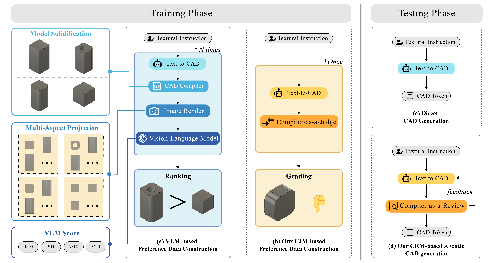
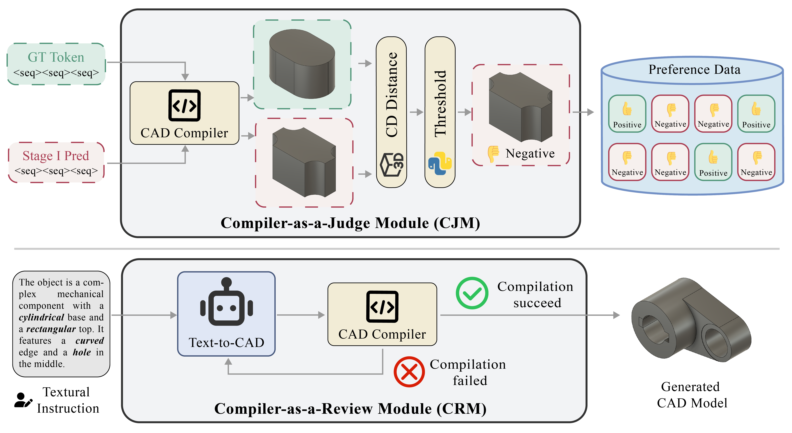
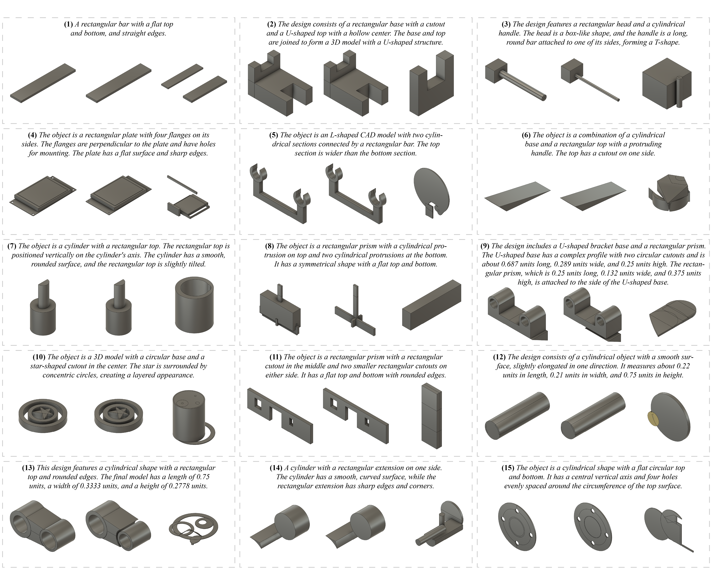

<!-- Using HTML to center the abstract -->
<div class="columns is-centered has-text-centered">
<div class="column is-four-fifths">
<h2>Abstract</h2>
<div class="content has-text-justified">
Computer-Aided Design (CAD) models are widely used across industrial design, simulation, and manufacturing processes. 
Text-to-CAD systems aim to generate editable, general-purpose CAD models from textual descriptions, significantly reducing the complexity and entry barrier associated with traditional CAD workflows. 
However, rendering CAD models can be slow, and deploying VLMs to review CAD models can be expensive and may introduce reward hacking that degrades the systems. 
To address these challenges, we propose CAD-Judge, a novel, verifiable reward system for efficient and effective CAD preference grading and grammatical validation. 
We adopt the Compiler-as-a-Judge Module (CJM) as a fast, direct reward signal, optimizing model alignment by maximizing generative utility through prospect theory. 
To further improve the robustness of Text-to-CAD in the testing phase, we introduce a simple yet effective agentic CAD generation approach and adopt the Compiler-as-a-Review Module (CRM), which efficiently verifies the generated CAD models, enabling the system to refine them accordingly. 
Extensive experiments on challenging CAD datasets demonstrate that our method achieves state-of-the-art performance while maintaining superior efficiency.
</div>
</div>
</div>

---

<!-- > Note: This is an example of a Jekyll-based project website template: [Github link](https://github.com/shunzh/project_website). -->

## Preference Data Construction



## Overview of Framework



## Visualization



## Citation
```
@misc{cad-judge,
      title={CAD-Judge: Toward Efficient Morphological Grading and Verification for Text-to-CAD Generation}, 
      author={Zheyuan Zhou and Jiayi Han and Liang Du and Naiyu Fang and Lemiao Qiu and Shuyou Zhang},
      year={2025},
      eprint={2508.04002},
      archivePrefix={arXiv},
      primaryClass={cs.CV},
      url={https://arxiv.org/abs/2508.04002}, 
}
```