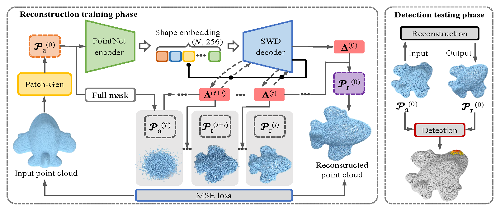
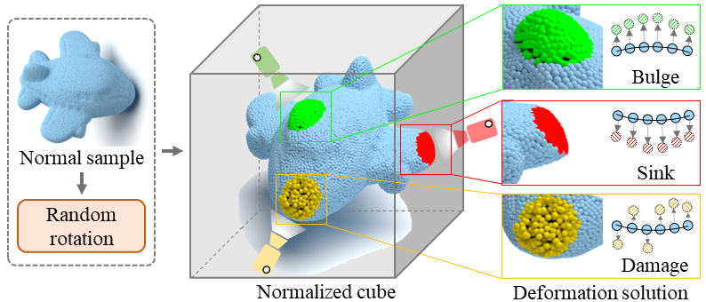
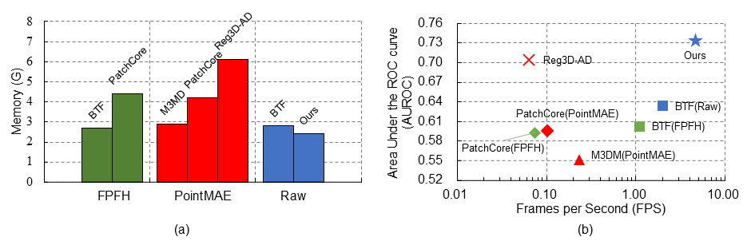
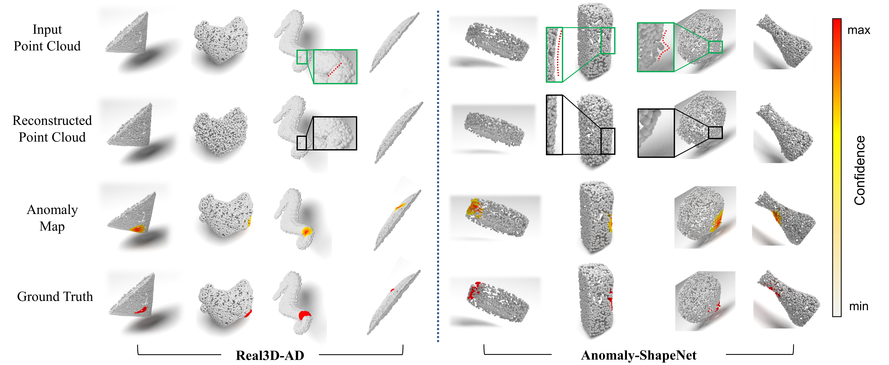

<section class="hero is-light is-small">
  <div class="hero-body">
    <div class="container">
      <div id="results-carousel" class="carousel results-carousel">

        <div class="item item-starfish">
          <div class="columns is-multiline">
            <div class="column is-half">
              <video poster="" id="starfish_defect" autoplay controls muted loop playsinline height="100%" style="width: 100%;">
                <source src="assets/projects/r3d-ad/starfish_defect.mp4" type="video/mp4">
              </video>
            </div>
            <div class="column is-half">
              <video poster="" id="starfish_gt" autoplay controls muted loop playsinline height="100%" style="width: 100%;">
                <source src="assets/projects/r3d-ad/starfish_gt.mp4" type="video/mp4">
              </video>
            </div>
          </div>
        </div>

        <div class="item item-seahorse">
          <div class="columns is-multiline">
            <div class="column is-half">
              <video poster="" id="seahorse_defect" autoplay controls muted loop playsinline height="100%" style="width: 100%;">
                <source src="assets/projects/r3d-ad/seahorse_defect.mp4" type="video/mp4">
              </video>
            </div>
            <div class="column is-half">
              <video poster="" id="seahorse_gt" autoplay controls muted loop playsinline height="100%" style="width: 100%;">
                <source src="assets/projects/r3d-ad/seahorse_gt.mp4" type="video/mp4">
              </video>
            </div>
          </div>
        </div>

        <div class="item item-bag">
          <div class="columns is-multiline">
            <div class="column is-half">
              <video poster="" id="bag_defect" autoplay controls muted loop playsinline height="100%" style="width: 100%;">
                <source src="assets/projects/r3d-ad/bag_defect.mp4" type="video/mp4">
              </video>
            </div>
            <div class="column is-half">
              <video poster="" id="bag_gt" autoplay controls muted loop playsinline height="100%" style="width: 100%;">
                <source src="assets/projects/r3d-ad/bag_gt.mp4" type="video/mp4">
              </video>
            </div>
          </div>
        </div>

        <div class="item item-vase">
          <div class="columns is-multiline">
            <div class="column is-half">
              <video poster="" id="vase_defect" autoplay controls muted loop playsinline height="100%" style="width: 100%;">
                <source src="assets/projects/r3d-ad/vase_defect.mp4" type="video/mp4">
              </video>
            </div>
            <div class="column is-half">
              <video poster="" id="vase_gt" autoplay controls muted loop playsinline height="100%" style="width: 100%;">
                <source src="assets/projects/r3d-ad/vase_gt.mp4" type="video/mp4">
              </video>
            </div>
          </div>
        </div>

      </div>
    </div>
  </div>
</section>

---

<!-- Using HTML to center the abstract -->
<div class="columns is-centered has-text-centered">
<div class="column is-four-fifths">
<h2>Abstract</h2>
<div class="content has-text-justified">
3D anomaly detection plays a crucial role in monitoring parts for localized inherent defects in precision manufacturing.
Embedding-based and reconstruction-based approaches are among the most popular and successful methods.
However, there are two major challenges to the practical application of the current approaches: 
1) the embedded models suffer the prohibitive computational and storage due to the memory bank structure; 
2) the reconstructive models based on the MAE mechanism fail to detect anomalous in the unmasked regions.
In this paper, we propose R3D-AD, reconstructing anomalous point clouds by diffusion model for precise 3D anomaly detection. 
Our approach capitalizes on the data distribution conversion of the diffusion process to entirely obscure the input's anomalous geometry.
It step-wisely learns a strict point-level displacement behavior, which methodically corrects the aberrant points. 
To increase the generalization of the model, we further present a novel 3D anomaly simulation strategy named Patch-Gen to generate realistic and diverse defect shapes, which narrows the domain gap between training and testing.
Our R3D-AD ensures a uniform spatial transformation, which allows straightforwardly generating anomaly results by distance comparison.
Extensive experiments show that our R3D-AD outperforms previous state-of-the-art methods, achieving 73.4% Image-level AUROC on the Real3D-AD dataset and 74.9% Image-level AUROC on the Anomaly-ShapeNet dataset with exceptional efficiency.
</div>
</div>
</div>

---

<!-- > Note: This is an example of a Jekyll-based project website template: [Github link](https://github.com/shunzh/project_website). -->

## Model Overview


The overall architecture of **R3D-AD** for shape reconstruction and anomaly detection of point cloud objects.

## 3D Anomaly Simulation


Illustration of **Patch-Gen**, the 3D anomaly simulation strategy. 
The input normal point cloud is first randomly rotated. 
On the surface of the normalized cube, we randomly select viewpoints to find the nearest patch of points. 
The selected points are then transformed into irregular defects according to the specific deformation solution.

## Efficiency


Memory and time cost during inference on the Real3D-AD dataset. 
(a) Memory usage comparison between different models. 
(b) 3D anomaly detection performance vs. frames per second on an NVIDIA RTX 3090 GPU. 
Our R3D-AD outperforms all previous methods in both accuracy and efficiency by a significant margin.

## Visualization


## Citation
```
@inproceedings{zhou2024r3dad,
  title={R3D-AD: Reconstruction via Diffusion for 3D Anomaly Detection},
  author={Zhou, Zheyuan and Wang, Le and Fang, Naiyu and Wang, Zili and Qiu, Lemiao and Zhang, Shuyou},
  booktitle={European Conference on Computer Vision (ECCV)},
  year={2024}
}
```